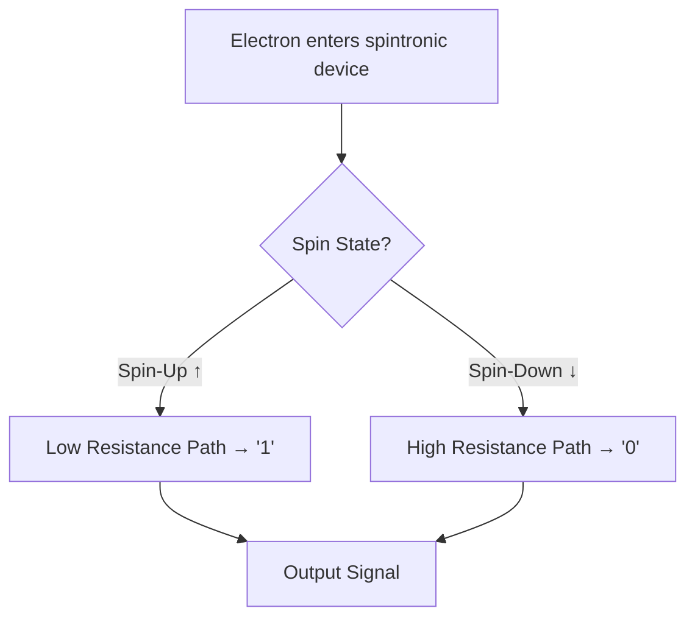

# ⚡ Electromagnetic Valence: A Comprehensive Deep Dive

> [!abstract] Executive Overview
> **Electromagnetic valence** sits at the intersection of atomic physics, chemistry, and materials science. It describes how the outermost electrons of an atom — the **valence electrons** — interact electromagnetically with their environment, neighboring atoms, and applied fields. These electrons are the fundamental drivers of chemical bonding, electrical conductivity, magnetism, and emerging quantum technologies. This document builds from atomic first principles up through real-world engineering applications and active research frontiers.

---

## Table of Contents

- [[#Part I — Foundations of Valence]]
  - [[#1.1 What Is Valence?]]
  - [[#1.2 The Atomic Shell Model]]
  - [[#1.3 Quantum Numbers and Orbital Types]]
  - [[#1.4 The Electromagnetic Nature of Valence Electrons]]
- [[#Part II — Electromagnetic Properties]]
  - [[#2.1 Electric Charge and Coulomb Interactions]]
  - [[#2.2 Electron Spin and the Magnetic Moment]]
  - [[#2.3 Valence Bands and Conduction Bands]]
  - [[#2.4 Periodic Trends Shaped by Valence]]
- [[#Part III — Practical and Pragmatic Applications]]
  - [[#3.1 Chemical Bonding]]
  - [[#3.2 Semiconductors and Electronics]]
  - [[#3.3 HOMO–LUMO and Reactivity]]
  - [[#3.4 Valence Electron Energy-Loss Spectroscopy (VEELS)]]
  - [[#3.5 Battery and Energy Storage Technology]]
- [[#Part IV — Advanced and Frontier Research Areas]]
  - [[#4.1 Spintronics]]
  - [[#4.2 Valleytronics]]
  - [[#4.3 Quantum Computing Applications]]
  - [[#4.4 Nanotechnology and 2D Materials]]
  - [[#4.5 Transition Metal Chemistry]]
- [[#Appendix — Quick Reference Tables]]

---

## Part I — Foundations of Valence

### 1.1 What Is Valence?

**Valence**, from the Latin *valentia* (power, capacity), refers to the combining capacity of an atom — specifically, how many other atoms it can bond with or react with under standard chemical conditions. Introduced into chemistry in 1868, the term was originally framed around hydrogen: how many hydrogen atoms a given element could displace or bond to. In modern usage, valence is inseparable from the concept of **valence electrons** — the electrons occupying the outermost shell of an atom that are directly responsible for all chemical and most electromagnetic behavior.

> [!quote] Classical Definition
> *"Valence is the property of an element that determines the number of other atoms with which an atom of the element can combine."*
> — Encyclopædia Britannica

Valence is **not** identical to:
- **Oxidation state** (which accounts for charge distribution in a bond)
- **Coordination number** (number of ligands around a central atom)
- **Number of valence electrons** per se (though it is tightly correlated)

It is a measure of bonding *capacity*, while valence electrons are the *mechanism* by which that capacity is exercised.

---

### 1.2 The Atomic Shell Model

Atoms are organized into concentric energy shells (also called **principal quantum levels**, designated by $n = 1, 2, 3...$). Electrons fill these shells from the inside out according to energy minimization rules:

| Shell | Max Electrons | Subshells Included | Example Elements with Full Shell |
|-------|--------------|-------------------|----------------------------------|
| n = 1 | 2            | 1s                | Helium (He)                      |
| n = 2 | 8            | 2s, 2p            | Neon (Ne)                        |
| n = 3 | 18           | 3s, 3p, 3d        | Argon (Ar) [partial]             |
| n = 4 | 32           | 4s, 4p, 4d, 4f    | Krypton (Kr) [partial]           |

The **outermost shell** at any given moment is called the **valence shell**, and every electron residing in it is a **valence electron**. Electrons in inner, fully-filled shells are called **core electrons** — they participate in no bonding and are electromagnetically screened from outside influence.

> [!example] Oxygen Example
> Oxygen's electron configuration is `1s² 2s² 2p⁴`. The `1s²` electrons are **core electrons**. The `2s²2p⁴` electrons in the second shell are the **valence electrons** — six total — and they are the ones that form water's covalent bonds and drive oxygen's high electronegativity.

---

### 1.3 Quantum Numbers and Orbital Types

Every electron in an atom is described by a unique set of four **quantum numbers**:

1. **Principal quantum number** $n$ — shell level; determines energy and size
2. **Angular momentum quantum number** $\ell$ — subshell shape (s, p, d, f)
3. **Magnetic quantum number** $m_\ell$ — orbital orientation in space
4. **Spin quantum number** $m_s$ — intrinsic angular momentum of the electron ($+\frac{1}{2}$ or $-\frac{1}{2}$)

The Pauli Exclusion Principle states that no two electrons in an atom may share an identical set of all four quantum numbers — this forces each orbital to hold at most two electrons with **opposite spins**.

The four primary orbital types relevant to valence are:

- **s orbital** — spherical, holds 2 electrons
- **p orbitals** — dumbbell-shaped, 3 orientations, holds 6 electrons
- **d orbitals** — complex multi-lobe shapes, 5 orientations, holds 10 electrons
- **f orbitals** — highly complex, 7 orientations, holds 14 electrons

> [!info] Orbital Fill Order (Madelung Rule)
> Orbitals fill in order of increasing $n + \ell$. When two subshells have the same $n + \ell$ value, the one with **lower** $n$ fills first. This produces the familiar "diagonal" filling pattern on the periodic table:
> `1s → 2s → 2p → 3s → 3p → 4s → 3d → 4p → 5s → 4d...`

---

### 1.4 The Electromagnetic Nature of Valence Electrons

Valence electrons are fundamentally electromagnetic entities. Every electron carries a charge of **−1.602 × 10⁻¹⁹ coulombs** and is bound to its nucleus via the **Coulomb force** — the electrostatic attraction between the negative electron and the positive protons. Coulomb's law governs this interaction:

\[
F = k \frac{q_1 q_2}{r^2}
\]

where $F$ is force, $k$ is Coulomb's constant (\(8.99 \times 10^9\) N·m²/C²), $q_1$ and $q_2$ are charges, and $r$ is distance.

Crucially, valence electrons are **more loosely bound** than core electrons because:
1. They are **farther from the nucleus**, so the Coulomb attraction is weaker (force ∝ 1/r²)
2. They experience **electron shielding** — core electrons partially cancel the nuclear charge felt by outer electrons

This "shielding effect" gives rise to the concept of **effective nuclear charge** ($Z_{\text{eff}}$):

\[
Z_{\text{eff}} = Z - S
\]

where $Z$ is atomic number and $S$ is the shielding constant. Higher $Z_{\text{eff}}$ means the nucleus pulls valence electrons closer and tighter — underpinning trends in electronegativity and ionization energy across the periodic table.

> [!warning] Common Misconception
> "Electromagnetic valence" is sometimes used loosely to describe entirely different phenomena in engineering contexts (e.g., antenna valence, RF valence). This document focuses strictly on **atomic/molecular valence electrons** and their electromagnetic properties, as understood in physics and chemistry.

---

## Part II — Electromagnetic Properties

### 2.1 Electric Charge and Coulomb Interactions

The electrostatic field surrounding an atom's nucleus creates a force environment in which valence electrons are constantly negotiating between **attraction** (nucleus pulling inward) and **repulsion** (other electrons pushing outward). This balance governs:

- **Atomic radius** — size of the electron cloud
- **Ionization energy (IE)** — the energy required to remove a valence electron from a gaseous neutral atom
- **Electron affinity (EA)** — energy released when an electron is added to the valence shell

Ionization energies are strictly sequential: removing each successive electron from an atom requires progressively more energy. This relationship is expressed:

\[
IE_1 < IE_2 < IE_3 < ... < IE_n
\]

The dramatic jump in IE between valence and core electron removal is one of the strongest empirical confirmations of the shell model. For example, removing the third electron from magnesium (Mg, 2 valence electrons) requires ~7,700 kJ/mol — roughly 10× the first ionization energy — because you are then stripping a **core electron**.

- [ ] **Study Task:** Calculate $Z_{\text{eff}}$ for sulfur (Z=16) using Slater's rules
- [ ] **Study Task:** Plot first ionization energies for Period 3 elements and identify the dip at Al and S

---

### 2.2 Electron Spin and the Magnetic Moment

One of the most profound electromagnetic properties of a valence electron is its **intrinsic spin** — a purely quantum mechanical property with no exact classical analogue. In 1922, the **Stern-Gerlach experiment** directed silver atoms through an inhomogeneous magnetic field and observed them split into exactly two discrete beams — empirical proof that electrons possess a quantized intrinsic angular momentum.

The **spin quantum number** $s = \frac{1}{2}$ produces two allowed states:
- $m_s = +\frac{1}{2}$ ("spin-up," ↑)
- $m_s = -\frac{1}{2}$ ("spin-down," ↓)

Because a spinning charged body generates a magnetic dipole, electron spin creates an **intrinsic magnetic moment**:

\[
\mu_s = -g_s \mu_B m_s
\]

where $\mu_B$ is the Bohr magneton (\(9.274 \times 10^{-24}\) J·T⁻¹) and $g_s \approx 2$ is the electron spin g-factor (derived from the Dirac equation). The measured value of the electron magnetic moment is $\mu_e = -9.2847646917 \times 10^{-24}$ J·T⁻¹. The negative sign indicates that the magnetic moment is **antiparallel** to the spin angular momentum vector.

> [!note] Why Spin Matters for Valence
> When valence electrons in **paired** orbitals have opposite spins, their magnetic moments cancel — the material is **diamagnetic** (slightly repelled by magnetic fields). When unpaired valence electrons exist (odd-electron systems or partially filled d-orbitals), the net magnetic moment makes the material **paramagnetic** or, in certain crystal structures, **ferromagnetic** or **antiferromagnetic**. This is the quantum origin of everyday magnetism.

---

### 2.3 Valence Bands and Conduction Bands

In a solid containing vast numbers of atoms (~$10^{23}$ per mole), individual atomic orbitals overlap and merge into continuous **energy bands**. The highest energy band occupied by electrons at absolute zero is the **valence band**; the next higher band (normally empty) is the **conduction band**. The energy gap between them is the **band gap** ($E_g$).

| Material Type | Band Structure | Band Gap ($E_g$) | Conductivity |
|--------------|---------------|-----------------|--------------|
| Metal         | Valence & conduction bands **overlap** | 0 eV | High (free electrons) |
| Semiconductor | Small gap between bands | ~0.7–1.1 eV (Ge/Si) | Moderate, temperature-dependent |
| Insulator     | Large gap between bands | >5 eV | Negligible |

In metals, valence electrons effectively become **free electrons** shared collectively throughout the lattice — this is the origin of metallic luster, thermal conductivity, and electrical conductivity. In semiconductors like silicon (4 valence electrons) and germanium (also 4), a small $E_g$ means electrons can be thermally excited from the valence band into the conduction band, enabling tunable conductivity that is the foundation of the entire semiconductor industry.

> [!tip] Doping and Semiconductor Engineering
> Semiconductor conductivity can be precisely tuned through **doping** — introducing impurities with more (n-type) or fewer (p-type) valence electrons than the host material. Adding phosphorus (5 valence electrons) to silicon (4 valence electrons) donates an extra electron to the conduction band, dramatically increasing conductivity.

---

### 2.4 Periodic Trends Shaped by Valence

The periodic table is ultimately an organizational map of **valence electron configurations**. All elements in the same group (column) share the same number of valence electrons, and this drives near-identical chemical behaviors.

Major electromagnetic/chemical periodic trends:

| Trend | Across a Period (→) | Down a Group (↓) | Driving Mechanism |
|-------|--------------------|-----------------|--------------------|
| Atomic radius | Decreases | Increases | Increasing $Z_{\text{eff}}$ / more shells |
| Ionization energy | Increases | Decreases | $Z_{\text{eff}}$ & shielding |
| Electronegativity | Increases | Decreases | Attraction strength for bonding pair |
| Electron affinity | Generally increases | Decreases | Tendency to accept electrons |
| Metallic character | Decreases | Increases | Looseness of valence electrons |
| Valence electrons (count) | Increases (+1 per group) | Constant (same group) | Group position |

Electronegativity — an atom's power to attract a shared bonding electron pair — is essentially a macroscopic expression of the Coulomb force: highly electronegative atoms (F, O, N, Cl) exert strong nuclear pull on their valence electrons and on electrons in adjacent bonds.

---

## Part III — Practical and Pragmatic Applications

### 3.1 Chemical Bonding

All chemical bonding — whether ionic, covalent, or metallic — is mediated entirely by **valence electrons** interacting through electromagnetic forces.

#### Ionic Bonding

Occurs when the difference in electronegativity between two atoms is large enough that one atom fully donates a valence electron to another, creating oppositely charged ions held by Coulomb attraction. The archetypal example is sodium chloride (NaCl): sodium's single loosely-held valence electron transfers to chlorine's nearly-full valence shell. The result is a $\text{Na}^+$ cation and a $\text{Cl}^-$ anion locked in a crystal lattice by electrostatic forces.

#### Covalent Bonding

When electronegativity differences are small, atoms **share** valence electrons. In water ($\text{H}_2\text{O}$), oxygen shares its valence electrons with two hydrogen atoms through covalent bonds. The overlap of atomic orbitals creates a region of increased electron density between nuclei, with Coulomb attraction from both nuclei holding the bond together.

\[
\text{Bond Order} = \frac{(\text{bonding electrons}) - (\text{antibonding electrons})}{2}
\]

Double bonds share two electron pairs; triple bonds share three. Each increment increases bond strength and decreases bond length.

#### Metallic Bonding

In metals, valence electrons are delocalized — the electron "sea" model describes free electrons moving throughout the entire metal lattice, with each atom contributing its valence electrons to a shared pool. This collective electromagnetic state explains:
- High electrical conductivity
- High thermal conductivity
- Metallic luster (electrons interact with photons across a broad spectrum)
- Malleability and ductility (electron sea allows layers to slip)

---

### 3.2 Semiconductors and Electronics

Silicon (Si) and germanium (Ge) — both with **four valence electrons** in a tetrahedral covalent lattice — are the foundational materials of modern electronics. Their four valence electrons form exactly four covalent bonds with neighbors, creating a stable crystalline structure with a band gap of approximately **1.12 eV** (Si) and **0.72 eV** (Ge).

The transistor, the backbone of all digital technology, operates by controlling the flow of electrons between valence and conduction bands using applied electric fields. The entire global semiconductor industry — from CPUs to memory chips to wireless radios — is a direct engineering exploitation of valence electron behavior.

```
Simplified MOSFET Operation:
  ┌─────────────────────────────────────┐
  │   Gate Voltage (controls field)     │
  │         ↓                           │
  │  [Source]──[Channel]──[Drain]        │
  │   (e- flow when gate enables it)    │
  │   Valence electrons bridge the gap  │
  └─────────────────────────────────────┘
```

**Optoelectronics** — including LEDs, solar cells, and laser diodes — exploits the fact that valence electrons emitting photons when they fall from the conduction band to the valence band. The photon's energy equals the band gap:

\[
E_{\text{photon}} = h\nu = E_g
\]

---

### 3.3 HOMO–LUMO and Reactivity

In molecular chemistry, the discrete orbital model gives way to **Molecular Orbital (MO) Theory**, in which atomic valence orbitals combine to form molecular orbitals spanning the entire molecule. The two most important of these are the **frontier orbitals**:

- **HOMO** — *Highest Occupied Molecular Orbital*: the highest-energy orbital containing electrons; acts as an **electron donor** (nucleophile) in reactions
- **LUMO** — *Lowest Unoccupied Molecular Orbital*: the lowest-energy empty orbital; acts as an **electron acceptor** (electrophile) in reactions

**Frontier Molecular Orbital (FMO) Theory**, developed by Kenichi Fukui (Nobel Prize in Chemistry, 1981), predicts that most chemical reactions are governed by the interaction between the HOMO of one molecule and the LUMO of another. The **HOMO-LUMO gap** is analogous to the band gap in solids:

| HOMO-LUMO Gap | Chemical Behavior |
|--------------|------------------|
| Large gap    | Chemically inert, stable (e.g., hydrocarbons, noble gas compounds) |
| Small gap    | Highly reactive, easily excited (e.g., conjugated dyes, radicals) |
| Zero gap     | Metallic-like behavior, extreme reactivity |

Applications of HOMO-LUMO theory span:
- **Drug design** — matching HOMO/LUMO of drug to receptor site
- **OLEDs and organic solar cells** — tuning HOMO/LUMO energies to match desired photon absorption/emission wavelengths
- **Catalysis** — designing transition states based on frontier orbital matching

---

### 3.4 Valence Electron Energy-Loss Spectroscopy (VEELS)

**VEELS** is a powerful analytical technique within transmission electron microscopy (TEM) that probes the energy-loss region below ~50 eV — the range dominated by **valence electron excitations** rather than core-level excitations. Two main processes are detected:

1. **Interband transitions** — single-electron excitations from valence band to conduction band
2. **Plasmon excitations** — collective oscillations of the entire valence electron density

VEELS provides:
- Band gap measurements at nanoscale spatial resolution (~1 nm probe)
- Complex dielectric function of nanoscale volumes
- Optical properties (refractive index, absorption coefficient) from individual nanoparticles
- Identification of bonding character and valency in mixed-valence compounds

A key advantage over conventional optical spectroscopy: VEELS achieves **sub-nanometer spatial resolution**, allowing characterization of individual nanoprecipitates, grain boundaries, and atomic-scale defects — information inaccessible to any optical method. Recent work has demonstrated VEELS determination of plasmon energies, elastic properties, hardness, and cohesive energy simultaneously from single nanoparticles.

> [!example] Battery Research Application
> VEELS has been applied to characterize lithium-ion battery electrode materials (e.g., LiCoO₂) where conventional Li-K edge EELS is challenging due to poor signal-to-background ratios. Valence EELS features at <20 eV provide comparable or superior morphological mapping with less beam damage — critical for studying battery material degradation at the nanoscale.

---

### 3.5 Battery and Energy Storage Technology

Valence electrons are the active players in every electrochemical storage system. In a lithium-ion battery:

1. During **charging**, lithium atoms lose valence electrons at the anode — the electrons flow through an external circuit while Li⁺ ions migrate through the electrolyte
2. During **discharge**, the process reverses, and electrons flow back through the external circuit, doing useful work

The key bottleneck — **energy density** — is directly tied to the number and mobility of valence electrons that can be stored and released per unit mass. Research into high-valence-electron-density materials (e.g., transition metal oxides, sulfides, and phosphates) is the primary driver of next-generation battery performance.

---

## Part IV — Advanced and Frontier Research Areas

### 4.1 Spintronics

**Spintronics** (spin-based electronics) represents a paradigm shift: rather than using only an electron's **charge** to carry information (as in conventional electronics), spintronics encodes information in the electron's **spin state** — up or down. This was made possible by the 1988 discovery of **Giant Magnetoresistance (GMR)** by Albert Fert and Peter Grünberg, which earned the 2007 Nobel Prize in Physics.



Key spintronic technologies already in commercial use:
- **Read heads in hard disk drives** — use tunneling magnetoresistance (TMR) to detect spin-polarized bit states
- **Magnetic RAM (MRAM)** — non-volatile memory that stores bits as spin orientations rather than charge states, offering near-infinite endurance and near-zero standby power

Emerging spintronic research areas include **spin-orbit torque (SOT)** devices, which use the spin-orbit interaction to generate spin currents without needing a magnetic reference layer — enabling faster, lower-power data writing. Researchers at Oak Ridge National Laboratory have recently demonstrated new quantum magnetic phenomena directly relevant to spintronic computing, reporting in February 2026 that precise control of atomic-scale spin interactions could lead to "transformative advances in computing and data storage."

---

### 4.2 Valleytronics

**Valleytronics** is a newer cousin of spintronics. In certain 2D semiconductors (particularly the transition metal dichalcogenide family, e.g., MoS₂, WS₂), the electronic band structure has two distinct "valleys" — local energy minima in momentum space — at points **K** and **K'** in the Brillouin zone. Electrons in these valleys carry a **valley quantum number** that can, in principle, be used to encode binary information just as spin is used in spintronics.

> [!info] Why Valleys?
> In a graphene-like hexagonal 2D lattice, time-reversal symmetry creates two inequivalent corners of the Brillouin zone (K and K'). Breaking the valley degeneracy — by applying circularly polarized light or proximity effects — allows selective population of one valley, creating a valley-polarized state readable as a logical bit.

Researchers at Lawrence Berkeley National Laboratory demonstrated in 2015 that the **optical Stark effect** — induced by femtosecond circularly polarized laser pulses — can selectively control valley populations in MoS₂, opening the first practical pathway to ultrafast valley manipulation. The technique offers a potential advantage over conventional charge-based electronics in **data processing speed**.

---

### 4.3 Quantum Computing Applications

Valence electron quantum states — both spin and orbital — are among the most actively pursued physical qubits for quantum computation. The key requirements for a qubit are:

- **Long coherence time** — the quantum state must survive long enough to perform operations
- **Controllability** — quantum gates must be applied with high fidelity
- **Scalability** — thousands to millions of qubits must be integrated

**Topological insulators** — materials where bulk valence electrons are insulating but surface states, arising from spin-orbit coupling, are metallic and topologically protected — are particularly promising. These surface states are immune to many forms of decoherence because they are protected by topology rather than energy gaps. Materials with specific arrangements of valence electrons in topologically non-trivial bands can host **Majorana fermions**, exotic quasiparticles that may enable fault-tolerant quantum computation.

The Center for Spintronics and Quantum Computation (UCSB) — involving researchers from MIT, IBM, Intel, and Tohoku University — focuses explicitly on manipulating valence electron quantum states in semiconductors and photonic nanostructures as a path to scalable quantum information processing.

---

### 4.4 Nanotechnology and 2D Materials

At the nanoscale, the distinction between "bulk" electromagnetic properties and the behavior of individual valence electrons blurs dramatically. Quantum confinement effects mean that the discrete energy levels of valence electrons — normally smeared into bands — re-emerge as sharp, tunable features.

Key 2D material examples:

- **Graphene** (single-layer carbon, $\pi$ valence electrons): zero band gap, ultrahigh electron mobility (~200,000 cm²/V·s at room temperature), theoretical thermal conductivity up to **5,300 W/m·K** — the highest of any known material
- **MoS₂ / WS₂** (transition metal dichalcogenides): indirect-to-direct band gap transition at monolayer thickness, strong spin-valley coupling, substrate for valleytronics
- **Boron nitride (BN)** hexagonal sheets: wide band gap insulator used as substrate/dielectric in 2D device stacks

**Carbon nanotubes** manipulate their carbon valence electrons to achieve exceptional electrical conductivity (can surpass copper), mechanical strength, and thermal stability. Depending on chirality, a nanotube can be metallic or semiconducting — controlled entirely by how the valence electrons' wavefunctions wrap around the tube axis.

> [!caution] Scale Limitations
> Nanoscale valence manipulation faces fundamental engineering challenges: atomic-level defects that would be irrelevant in bulk materials can dramatically alter valence electron behavior at the nanoscale. Reproducibility, edge states, and substrate interactions remain active research problems.

---

### 4.5 Transition Metal Chemistry

Transition metals (Groups 3–12) are unique because their **d orbitals** act as valence orbitals alongside the outermost s orbitals, providing 9 total valence orbitals and up to **18 possible valence electrons**. This "18-electron rule" governs the stability of transition metal complexes (analogous to the 8-electron octet rule for main-group elements).

The electromagnetic richness of transition metal valence shells generates:

1. **Multiple oxidation states** — e.g., manganese can exist in +2, +3, +4, +6, and +7 states; each has distinct electromagnetic properties and reactivity
2. **Colored compounds** — d-d electronic transitions absorb visible light when d-electrons are promoted between split d-orbital energy levels by ligand fields (Crystal Field Theory / Ligand Field Theory)
3. **Magnetic properties** — unpaired d-electrons produce paramagnetic or ferromagnetic behavior
4. **Catalytic activity** — the ability to change oxidation state while holding substrate in coordination sphere makes transition metals essential catalysts (e.g., Fe in hemoglobin, Ru in Grubbs catalyst, Pt in catalytic converters)

**Valence Electron Concentration (VEC)** is a quantitative parameter used to design transition metal-based alloys and cluster compounds. Research has shown VEC is the primary "thumb rule" for tuning atomic structure and electronic properties in Mo–S–I cluster-based nanostructures — a finding with direct implications for nanoscale device design.

> [!example] Iron in Biology
> Hemoglobin's oxygen transport is entirely a valence electron story. The Fe²⁺ ion in heme has a partially filled d-shell that can form a reversible coordination bond with O₂. When oxygen binds, it partially oxidizes iron (Fe²⁺ → Fe³⁺ character), altering the spin state from high-spin to low-spin. This electronic spin transition is a **conformational trigger** that propagates through the entire hemoglobin tetramer — the allosteric mechanism that makes cooperative oxygen binding possible.

---

## Appendix — Quick Reference Tables

### A.1 Valence Electron Count by Group (Main Group Elements)

| Group | Valence Electrons | Example Element | Common Bonding Behavior |
|-------|-------------------|-----------------|------------------------|
| 1 (IA) | 1 | Na, K | Ionic donor; forms +1 ions |
| 2 (IIA) | 2 | Mg, Ca | Ionic donor; forms +2 ions |
| 13 (IIIA) | 3 | Al, B | Covalent/metallic; Lewis acid |
| 14 (IVA) | 4 | C, Si | Covalent tetrahedra; semiconductors |
| 15 (VA) | 5 | N, P | Covalent; lone pairs; donors |
| 16 (VIA) | 6 | O, S | Covalent; high electronegativity |
| 17 (VIIA) | 7 | F, Cl | Ionic acceptor; forms −1 ions |
| 18 (VIIIA) | 8 | Ne, Ar | Full shell; chemically inert |

---

### A.2 Key Electromagnetic Quantities for Electrons

| Quantity | Symbol | Value | Significance |
|----------|--------|-------|--------------|
| Elementary charge | $e$ | $-1.602 \times 10^{-19}$ C | Charge of one electron |
| Electron magnetic moment | $\mu_e$ | $-9.2848 \times 10^{-24}$ J·T⁻¹ | Intrinsic magnetic dipole |
| Bohr magneton | $\mu_B$ | $9.274 \times 10^{-24}$ J·T⁻¹ | Unit for atomic magnetic moments |
| Spin quantum number | $s$ | $\frac{1}{2}$ | Always ½ for electrons |
| Spin g-factor | $g_s$ | ≈ 2.00232 | From QED corrections to Dirac value |
| Electron mass | $m_e$ | $9.109 \times 10^{-31}$ kg | Sets kinetic energy scale |

---

### A.3 Active Research Domains Matrix

| Research Area | Core Valence Property Exploited | Maturity | Key Application |
|--------------|-------------------------------|----------|-----------------|
| Semiconductor devices | Band gap (charge) | Commercial | CPU, memory, sensors |
| Spintronics | Spin magnetic moment | Commercial (HDD); R&D (MRAM) | Data storage, logic |
| Valleytronics | Valley quantum number | Early R&D | Ultrafast logic |
| Topological materials | Spin-orbit coupled surface states | R&D | Fault-tolerant quantum computing |
| 2D materials (graphene etc.) | π-electron delocalization | R&D → Emerging commercial | Flexible electronics, sensors |
| VEELS characterization | Plasmon / interband excitation | Established technique | Nanoscale materials analysis |
| Organic electronics (OLED/OPV) | HOMO-LUMO gap | Commercial | Displays, solar cells |
| Battery electrodes | Valence state transitions | Commercial R&D | Energy density, cycle life |

---

*Document end. Internal wikilinks marked `[[...]]` are Obsidian-compatible. Callout blocks use Obsidian callout syntax (`> [!type]`). Frontmatter YAML is Obsidian-compatible for Dataview queries and metadata display.*

---

**Tags:** #electromagnetic-valence #quantum-mechanics #chemistry #physics #spintronics #semiconductors #materials-science #nanotechnology #VEELS #HOMO-LUMO #band-theory #valence-electrons
