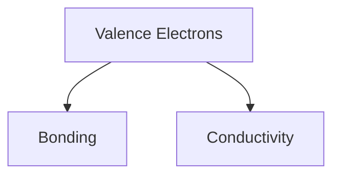

# Electromagnetic Valence Notes

> [!abstract] Overview
> Real-world notes with mixed authoring patterns copied from an Obsidian vault.



<div class="callout callout-warning">
<p>Raw HTML is intentionally included to verify unsupported diagnostics classification.</p>
</div>

## Quick checks

- Wiki links like [[Quantum Numbers]] should remain as literal markdown text.
- Inline equation: $Z_{\text{eff}} = Z - S$.
- Fenced code should preserve language tags.

```python
for shell in ["s", "p", "d", "f"]:
    print(shell)
```
